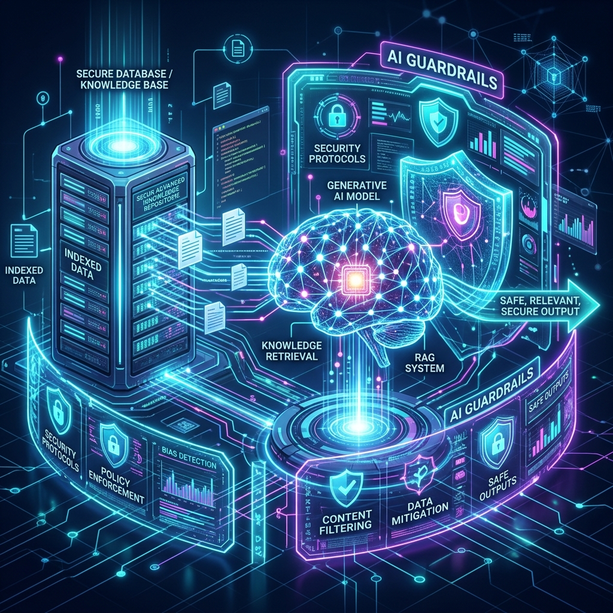

# Meningkatkan Akurasi Agentic AI dengan RAG & Guardrails

**Kategori:** AI Testing
**Tanggal:** Juni 2026

*(Gambar ilustrasi AI dengan RAG & Guardrails)*

Seiring dengan adopsi Agentic AI di dalam Software Testing, masalah utama yang sering dihadapi adalah halusinasi dan keluarnya model dari konteks utama (off-topic). Pada rilis terbaru QA Portfolio ini, kami telah menuntaskan masalah tersebut secara elegan melalui arsitektur Lightweight RAG (Retrieval-Augmented Generation) dan Strict AI Guardrails.

## Apa Itu AI Guardrails?

AI Guardrails adalah pagar pengaman atau boundary yang kami pasang pada lapisan prompt dan API. Dengan guardrails yang ketat, AI tidak akan pernah melayani pertanyaan umum di luar konteks (misalnya: menanyakan resep masakan, cuaca, atau membuat game). Ini menjaga profesionalitas dan melindungi batasan kuota API dari penyalahgunaan (Token Abuse).

## Integrasi Lightweight RAG

Meskipun Gemini 2.5 memiliki kecerdasan yang hebat, ia tidak memiliki pengetahuan mengenai struktur spesifik website portofolio ini. Di sinilah RAG berperan.

Alih-alih menggunakan Vector Database yang berat, kami menyuntikkan (inject) representasi Markdown dari struktur asli Document Object Model (DOM) dan fitur utama aplikasi langsung ke dalam System Context (In-Memory Context-Injection). Pendekatan ini disebut "Lightweight RAG".

### Manfaat Nyata RAG & Guardrails:

- **Akurasi Ekstrem:** AI dapat menghasilkan locator Playwright yang presisi karena ia "membaca" struktur HTML yang di-supply oleh RAG (misalnya ia tahu adanya elemen `input[name="email"]` pada form Contact).
- **Keamanan Fokus:** Model secara sopan akan menolak task di luar scope Software QA dan Playwright E2E Testing.
- **Zero Config Dependencies:** Semuanya berjalan mulus pada lingkungan Serverless Next.js (Edge/Node) tanpa latensi dari koneksi ke VectorDB eksternal.
